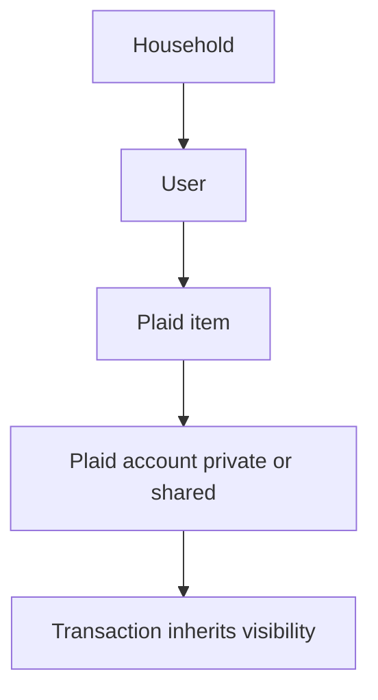
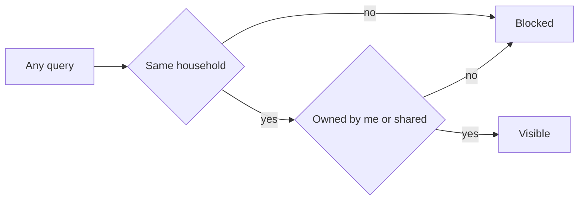

# Data model & RLS

How identity, ownership, and the isolation predicate fit together. The Phase 1a plan's enforcement page shows how this is wired into the running system.

## Requirements

- Every piece of financial data can be traced to the household and the person it belongs to.
- A member only ever sees data from their own household, and within it only what they own or what has been shared with them.
- In a shared conversation, private information is automatically held back, with no extra steps from either spouse.

## identity — Identity tables

Two new tables anchor tenancy. `households` is the tenant. `users` carries a `household_id`, an `email`, and an `external_auth_id` (the Clerk/Auth0 subject, null until phase 2). A revived `plaid_accounts` table is the source of truth for per-account ownership and sharing, carrying `owner_user_id`, `household_id`, and a `visibility` of `private` or `shared`.

## ownership-chain — The ownership chain

A Plaid item is owned by whoever connected it; each account under it is owned by a user and flagged private or shared; a transaction has no flag of its own and derives visibility from its account. To keep the security policy fast, `household_id`, `owner_user_id`, and `visibility` are denormalized onto every financial table so the policy never needs a join.

## rls-predicate — The isolation predicate

Every per-household table with ownership gets one policy: a row is visible when its household matches the current household, and either it is owned by the current user or it is shared. Tables without ownership, such as the taxonomy, use only the household term. In a joint session the current user is set to a nil sentinel, so the owner arm never matches and only shared rows pass — one policy serving both modes.

