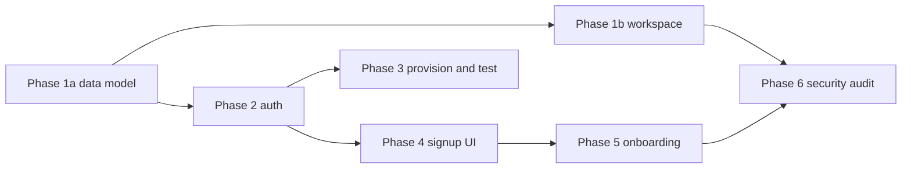

# Multi-Account Support for Penny

Turn Penny from a single-user finance agent into a multi-tenant product that a household — starting with two spouses — can use, with bank-grade isolation of personal financial data. The work is six sequenced sub-projects, each with its own spec, plan, and build cycle. Phase 1a (the data model) is fully planned; the rest are framed here and detailed when reached.

## Requirements

- Two spouses can share a single Penny and see a combined household view of their finances whenever they both choose to.
- Either spouse can mark an account private so it stays hidden from their partner and from everyone else.
- No household can ever reach another household's financial data, no matter how the question is asked.
- The reader can trace the whole effort as a sequence of phases, each with its own goal and current state.

## the-goal — The goal

Two people should share one Penny, see a combined household picture where they choose to, and keep private accounts genuinely private — from each other and from every other household. Financial data leaking across a household boundary, or a spouse's private account leaking within one, is the failure this whole effort exists to prevent. Security is treated as a property of every phase, not a final audit.

## strategy — Strategy

A household is the hard tenant boundary; within it, each Plaid account is owned by a user and is private or shared. Isolation is enforced twice: Postgres row-level security as the hard backstop (covering even the agent's `run_sql`), and app-level filtering as the legible second layer. The data layer is auth-agnostic — everything reads a `RequestContext` — so phase 1 can ship and be tested with a stubbed principal before real login arrives in phase 2.

The shared design lives here, in [foundation decisions](foundation/index.html). Each phase is its own SmartPlan (see below).

## the-plans — The plan series

This is the hub. Each phase is a **separate SmartPlan** under `docs/superpowers/plans/smartplans/`. When the whole series is served together, the **Open** links below jump straight to each phase, and every phase links back here.

| Phase | Open | State |
| --- | --- | --- |
| Foundation & shared design | this plan | shared design |
| Phase 0 — Design system | awaiting templates | roadmap |
| Phase 1a — Multi-tenant data model | [open](/p/phase-1a/) | designed + planned |
| Phase 1b — Workspace hybrid | [open](/p/phase-1b/) | designed + planned |
| Phase 2 — Auth / social login | [open](/p/phase-2/) | designed + planned |
| Phase 3 — Cutover & migration | [open](/p/phase-3/) | designed |
| Phase 4 — Signup UI | [open](/p/phase-4/) | designed + planned |
| Phase 5 — Onboarding | [open](/p/phase-5/) | designed + planned |
| Phase 6 — Security audit | [open](/p/phase-6/) | designed + planned |

Serve the whole series together with `serve smartplans/overview smartplans/phase-1a … smartplans/phase-6` (one server hosts all of them, each at `/p/<phase>/`, with an index listing every plan). Phases stay slim until we brainstorm them, then each is fleshed out in place.

## tradeoffs — Key tradeoffs

The biggest deliberate choice is **strict-first isolation**: user-centric RLS from day one. Loosening it later is a one-line policy change; tightening later would be a risky backfill run with a leak window in between. The second is **belt-and-suspenders enforcement** — RLS plus app filtering — accepting a little duplication to avoid a single missed `WHERE` becoming a data breach. The third is the **hybrid workspace store**: Postgres brokers access, R2 holds bytes, trading git's diff ergonomics for one unified security boundary.
