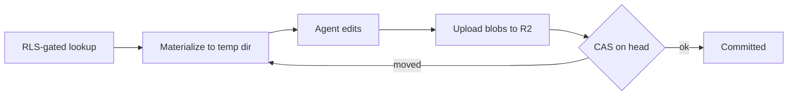

# Workspace storage

Today the workspace is a local git repo at `~/.transactoid`. Multi-tenant and remote-deployable, it becomes a hybrid store. The build details are in phase 1b.

## why-hybrid — Why a hybrid

Two clean options each fall short: putting files in Postgres reuses the security boundary but fights the agent's filesystem expectations and bloats with blobs; putting files in object storage is durable and cheap but creates a second isolation surface the database does not protect. The hybrid takes the best of both — **Postgres and RLS as the capability broker, R2 as the blob store** — so authorization rides on the same boundary as financial data while bytes live where bytes belong.

## layout — Layout and lookup

R2 directories are addressed by opaque high-entropy tokens, never guessable household ids. Layout partitions by visibility: one shared prefix per household, one private prefix per user. Postgres holds pointer rows under the same RLS policy; the app derives an R2 key only from an RLS-gated lookup, and the lookup returns only the prefixes the current principal and session mode may read. A joint session never even resolves a private prefix, so private bytes never reach the temp dir.

## versioning-cas — Versioning and atomic writes

The mental model is: temp dir is the working tree, R2 is the object store, a Postgres manifest is the commit. The agent edits the temp dir freely during a run; at the run boundary the flush uploads changed blobs as immutable R2 object versions, then performs the one mutating step — a compare-and-set on the household workspace head. If the head moved, re-materialize and retry. Blobs upload first and are side-effect-free, so the only state change is the atomic CAS, leaving no half-applied commit.

