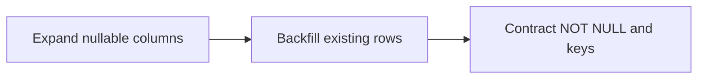

# Migrations

How the schema moves from single-user to multi-tenant without losing the existing real data. Appended to the current Alembic chain; the [enforcement page](enforcement.html) covers the RLS migration that follows.

## chain — The migration chain

Eight new revisions extend the existing chain (current head `005`): `006` adds households and users, `007` revives `plaid_accounts`, `008` adds the nullable tenant columns, `009` backfills them, `010` tightens to NOT NULL with keys and checks, `011` enables RLS, `012` makes the taxonomy per-household, and `013` encrypts existing tokens.

## expand-backfill-contract — Expand, backfill, contract

Schema changes on a populated database follow the safe three-step pattern. **Expand**: add `household_id`, `owner_user_id`, and `visibility` as nullable columns. **Backfill**: assign every existing row to your household and you as owner, default `private`, and create one `plaid_accounts` row per distinct account. **Contract**: set NOT NULL, add foreign keys, a visibility check, and composite indexes. Splitting these means no step rewrites a column that is still being read.

## dialect-guard — Dialect guarding

Migrations run on both Postgres and SQLite. Ordinary DDL works on both, but RLS is Postgres-only, so the policy migration is wrapped in a Postgres check and SQLite dev simply skips it. SQLite cannot alter a column in place, so the contract step uses Alembic batch mode, which recreates the table on SQLite and emits plain alters on Postgres.
