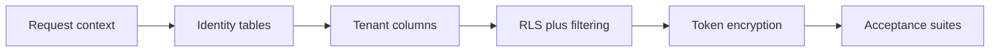

# Phase 1a — Multi-tenant data model

The foundation everything else sits on: make every financial row belong to a household and an owner, enforce isolation with RLS plus app filtering, and encrypt Plaid tokens at rest — all driven by a stubbed `RequestContext` so it is testable before real auth.

Part of the Multi-Account epic — the [overview plan](/p/overview/) is the hub linking all phases.

## Requirements

- Two people in one household can each see their own accounts and any account the other has chosen to share, and never anything from another household.
- A spouse's private account stays invisible to the other spouse, even when the agent runs arbitrary database queries.
- Existing single-user data keeps working, reassigned to the right household and owner with nothing shared until someone opts in.
- Bank access tokens are never readable in the database or logs.

## goal — Goal

Deliver a backend that is fully multi-tenant and leak-tested, with the data layer reading a `RequestContext` that phase 2 will later fill with real identity — no data-layer rework when auth arrives.

## sequence — Task sequence

Fourteen TDD tasks: request context and a dev-stub principal, then identity tables, a revived `plaid_accounts`, the expand–backfill–contract [migrations](migrations.html), session plumbing and app-level filtering, the [RLS policies](enforcement.html), wiring context into the request path, per-household taxonomy, Plaid token encryption, and the [acceptance suites](testing.html).

## key-choices — Key choices

UUID primary keys for new identity and tenant columns, so the policy's uuid casts work and ids stay opaque. Transaction-local settings via `set_config` rather than literal `SET LOCAL`, so the household and user can be bound parameters. RLS policies include a write check, so a tenant cannot write a row into another household, not just read-isolate. The large workspace store is split into phase 1b to keep this plan reviewable.
