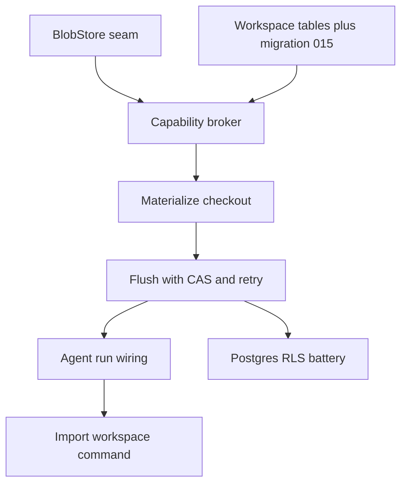

# Build sequence

The implementation lands in eight test-driven tasks that stack from the storage seam upward to the proof-of-isolation suite. Each task ships behind the standard verification gate (ruff, format, pytest) and reuses phase 1a's tenancy plumbing. This page is the map; the [capability broker](broker.html) and [versioning and CAS](versioning.html) pages hold the design detail.

## Requirements

- When the work is complete, a household's memory, rules, and reports live on the same protected boundary as its financial data.
- The move preserves each household's isolation — no household can reach another's files, and a shared conversation can never touch a private one.
- A household's existing local files are carried over into the new store without loss.

## sequence — How the tasks stack

Two foundation seams come first and independently: the `BlobStore` interface over R2, and the three RLS-protected tables in migration 015. The broker sits on both. Materialize and flush build the read and write halves of the sync layer on top of the broker. Only then does the integration tier land — wiring every agent run in materialize-run-flush, the one-time import command, and the Postgres RLS battery that proves a joint run can never touch a private prefix.

## tasks — The eight tasks

- **BlobStore seam** — a small put/get/exists interface with an R2-backed implementation and an in-memory fake, plus content-addressed keys (prefix token then sha256) so every test runs off the network.
- **Workspace tables + migration 015** — the prefix, manifest, and head tables with partial unique indexes, visibility checks, and — on Postgres — the phase-1a tenant-isolation policy (USING and WITH CHECK) with forced row-level security.
- **Capability broker** — lazily mints the household's shared prefix and each user's private prefix with opaque tokens, and resolves the readable set per session mode (private plus shared for individual, shared only for joint).
- **Materialize** — reads each readable prefix's head manifest and pulls its blobs into a per-run checkout, recording which prefix each file came from for visibility-routed write-back.
- **Flush** — diffs the checkout against the baselines, uploads changed blobs, routes new files to the right prefix, and advances each touched head with a compare-and-set, retrying last-writer-wins on conflict.
- **Agent-run wiring** — a materialize-run-flush wrapper around every chat and cron run; the memory loader reads the checkout instead of the local filesystem, and an aborted run flushes nothing.
- **Import-workspace command** — a one-time admin command that migrates the old `~/.transactoid` memory and reports tree into the user's private prefix, idempotently.
- **Postgres RLS battery** — the cross-household, spouse-private, joint-only, and WITH-CHECK isolation tests that prove the security boundary end to end.
