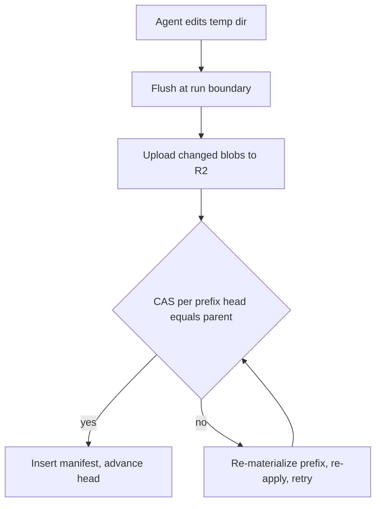

# Versioning & CAS

The mental model: **temp dir = working tree, R2 = object store, a Postgres manifest = the commit.** The read side is in the [capability broker](broker.html).

## manifests — Manifests over immutable blobs

R2 holds content as immutable, content-addressed blobs keyed `prefix token then sha256`. Postgres holds an append-only **manifest** row per save: the set of blobs making up that point-in-time snapshot, chained to its parent, under the same RLS policy. The manifest is the source of truth for "current version"; rollback is pointing the head at an older manifest. **Refinement from the implementation plan:** heads are per-*prefix* (shared, private-per-user), not one per household — a household-wide head cannot survive RLS, because a joint run's flush would have to copy forward private entries it cannot read, so those files would vanish from the head. Per-prefix chains keep every guarantee; a joint run only ever holds the shared head, and a run editing both scopes performs one CAS per touched prefix.

## commit-cas — Commit boundary & atomic CAS

The agent edits the temp dir freely during a run (many edits, zero R2/Postgres traffic per edit). Versioning happens at the **run boundary**. The flush uploads changed blobs **first** — content-addressed and idempotent, so a re-upload is a no-op and orphans from a losing race are harmless — then performs the single mutating step **per touched prefix**: a **compare-and-set** that advances that prefix head *iff* it still equals the parent we materialized from. If a CAS fails, the head moved: re-materialize that prefix, re-apply this run's changed files **last-writer-wins per file**, and retry; after a bounded number of retries it raises a flush-conflict error rather than looping forever. The only state change is the atomic CAS, so there is never a half-applied commit; an aborted run simply never flushes.

## write-back — Visibility-routed write-back

Each changed file flushes back to the prefix it came from — shared to the shared prefix, private to the owner's private prefix. A **joint session only ever materialized shared files, so it can only write shared** — private data cannot leak outward even on write. New files default to **private** in an individual session (promotable later) and **shared** in a joint one (the only scope available).

## tests — Test suite

Postgres-marked: (a) a joint session never resolves a private prefix — private bytes never reach the temp dir; (b) concurrent flushes off the same parent — one CAS wins, the loser re-materializes and retries, no lost update; (c) an aborted run commits nothing. Where these tests sit in the eight-task build order is on the [build sequence](build.html) page.
