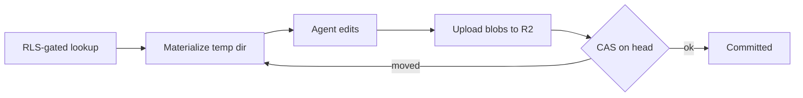

# Phase 1b — Workspace hybrid

Part of the Multi-Account epic — the [overview plan](/p/overview/) is the hub linking all phases.

Move the per-household workspace — memory, merchant rules, reports — off the local filesystem onto the hybrid store: Postgres + RLS as the capability broker, R2 as the blob store. Depends on phase 1a's `RequestContext`, RLS, and visibility model.

## Requirements

- A household's memory and reports survive restarts and redeploys, and are reachable only by that household.
- A joint conversation can read shared notes and reports but never a private one.
- Two overlapping agent runs in the same household never silently overwrite each other's saved work.
- An agent run that crashes mid-way leaves the saved workspace unchanged.

## goal — Goal

Replace the single-user filesystem workspace with a durable, isolated, versioned store, so per-household files ride on the same security boundary as financial data and never leak across households or between spouses.

## pipeline — The pipeline at a glance

Reads resolve an RLS-gated pointer, sync the allowed blobs into a per-run temp dir, and let the agent work locally. Writes reverse it at the run boundary: upload changed blobs, then a single atomic compare-and-set on the workspace head. The [capability broker](broker.html) covers the read side; [versioning and CAS](versioning.html) covers the write side.

## deliverables — What gets built

Extend the R2 adapter (today only put and get) with list-by-prefix, delete, and object-version handling; add the pointer and append-only manifest tables under the same RLS policy; build the broker lookup, the materialize step, and the flush-with-CAS; wire the memory loader to read the materialized temp dir per session mode; and cover it with the workspace test suite. Detail is split across the two sub-pages.
