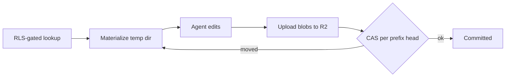

# Phase 1b — Workspace hybrid

Part of the Multi-Account epic — the [overview plan](/p/overview/) is the hub linking all phases.

Move the per-household workspace — memory, merchant rules, reports — off the local filesystem onto the hybrid store: Postgres + RLS as the capability broker, R2 as the blob store. Depends on phase 1a's `RequestContext`, RLS, and visibility model.

## Requirements

- A household's memory and reports survive restarts and redeploys, and are reachable only by that household.
- A joint conversation can read shared notes and reports but never a private one.
- Two overlapping agent runs in the same household never silently overwrite each other's saved work.
- An agent run that crashes mid-way leaves the saved workspace unchanged.

## goal — Goal

Replace the single-user filesystem workspace with a durable, isolated, versioned store, so per-household files ride on the same security boundary as financial data and never leak across households or between spouses.

## pipeline — The pipeline at a glance

Reads resolve an RLS-gated pointer, sync the allowed blobs into a per-run temp dir, and let the agent work locally. Writes reverse it at the run boundary: upload changed blobs, then one atomic compare-and-set per touched prefix head. The [capability broker](broker.html) covers the read side; [versioning and CAS](versioning.html) covers the write side; the [build sequence](build.html) shows how the eight tasks stack up.

## deliverables — What gets built

A new `workspace_store` package: a `BlobStore` seam over the existing R2 adapter (an in-memory fake keeps tests off the network); three RLS-protected pointer/manifest/head tables shipped in migration 015; the capability broker that lazily mints opaque prefixes and resolves the readable set per session mode; a materialize step that pulls head manifests into a per-run checkout; and a flush that uploads content-addressed blobs then advances each touched prefix head with a compare-and-set and retry. Around it: the memory loader reads the checkout instead of the local filesystem, every agent run (chat and cron) is wrapped in materialize-run-flush, an `import-workspace` admin command migrates the old `~/.transactoid` tree, and a Postgres RLS battery proves the isolation. Detail is split across the three sub-pages.
