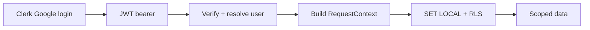

# Phase 2 — Auth / social login

Part of the Multi-Account epic — the [overview plan](/p/overview/) is the hub linking all phases.

Replace phase 1a's dev-stub principal with real, verified identity from **Clerk** (Google login), gated to two invited spouses — without changing the data layer, which already reads a `RequestContext`.

## Requirements

- Each spouse signs in with Google and reaches only their household's data.
- Nobody outside the invited list can obtain a session.
- The agent and every API call act as the signed-in user, with no change to how the data layer enforces isolation.

## goal — Goal

Fill the `RequestContext` from a verified login instead of a stub, so the isolation built in phase 1a now keys on a real, authenticated person — and close the auth, CORS, and `run_sql` holes surfaced in security review.

## flow — The request flow

Clerk authenticates in the browser and issues a JWT. A backend dependency verifies it, resolves it to a `users` row, builds the phase-1a `RequestContext`, and sets the ContextVar; RLS then enforces isolation unchanged.

Detail lives in the sub-pages: [identity & linking](identity.html), [backend verification](backend.html), [conversation scoping](conversations.html), [frontend](frontend.html), and [hardening & testing](hardening.html).

## decisions — Locked decisions

Clerk (Google). No user creation here — link an authenticated identity to an existing `users` row by verified email; allowlist = the `users` table. Session mode stays binary (individual | joint), per-conversation and immutable. `run_sql` goes read-only. Cron builds an explicit context and fails closed. The participant-set generalization is deferred (open question: how to designate an account shared to a subset).
