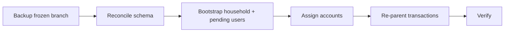

# Phase 3 — Production cutover & legacy-data migration

Part of the Multi-Account epic — the [overview plan](/p/overview/) is the hub linking all phases.

A one-time, fully programmatic cutover that moves the existing single-user production data into the multi-tenant world: reconcile the schema, create the household + pending users, interactively assign each linked account's owner and visibility, re-parent all legacy transactions, and hand off to Phase-4 signup — safely and rehearsably.

## Requirements

- My existing transactions all end up in one household with the right owner and visibility, and nothing is left unassigned.
- I can pick, per linked account, whether it is mine or my wife's and whether it is private or shared.
- If anything goes wrong, I can restore production from an untouched backup taken before any change.
- After the cutover I sign in and see my accounts plus shared ones; my wife sees hers plus shared ones, never my private accounts.

## goal — Goal

Carry the legacy data across the multi-tenant boundary once, correctly, and safely — with a frozen restore point and a full rehearsal before production is touched.

## stages — The stages

A `penny-cutover` CLI runs ordered, idempotent, resumable stages (each with a dry run): back up, reconcile the schema, bootstrap the household and pending users, assign accounts, re-parent, verify. See [schema reconciliation](schema.html), [assignment and handoff](assign.html), and [safety and validation](safety.html).

## decisions — Locked decisions

The cutover code lives in a non-canonical `backend/transient/account-cutover/` directory — not app code, exempt from the lint/test gate, deletable when done. Account assignment is interactive, with every choice written to a mapping record file. The backup is a frozen Neon branch left untouched until verify passes. Alembic becomes production's sole schema authority afterward. The pending-user handoff reuses the Phase-4 signup + first-login-link mechanism — no merge, no special-casing.
