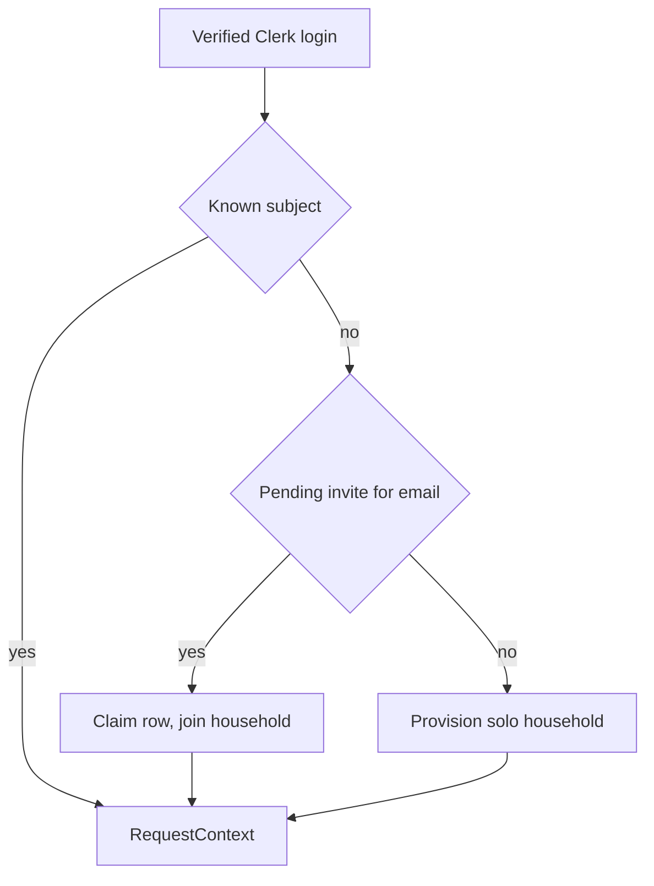

# Phase 4 — Signup / Account-creation UI

Part of the Multi-Account epic — the [overview plan](/p/overview/) is the hub linking all phases.

Open self-serve signup: anyone who signs in gets an isolated one-person household, and any member can invite **new** people who sign up directly into that household. No merge, no multi-household membership.

## Requirements

- Anyone with a Google account can sign up and land in a working, isolated household of their own.
- A household member can invite someone new, and that person lands in the inviter's household — not a fresh one.
- Someone who already has an account cannot be pulled into another household; they are told to start fresh.
- Two strangers who sign up independently can never see each other's data.

## goal — Goal

Make account creation fully self-serve so growth past the first two users needs no manual database work, while keeping phase 1a's one-household-per-user model completely intact.

## model — The model

Signup with no invite creates a solo household ([self-serve signup](signup.html)). An invite pre-creates a pending user row in the inviter's household, which the invitee's first login claims ([invites](invites.html)). Existing-account users are not invitable — they start fresh and can re-link the same bank via Plaid into the new household (independent links, no shared rows).

## decisions — Locked decisions

Fully open signup (no allowlist — this replaces phase 2's unknown-user 403 with auto-provision). Invites are new-users-only. One individual = one household, preserved. The solo-household re-parent alternative for existing users is recorded as future work on the [security & testing](testing.html) page. Guided onboarding is phase 5.
