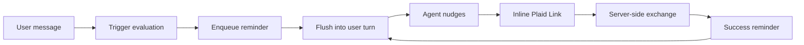

# Phase 5 — Onboarding

Part of the Multi-Account epic — the [overview plan](/p/overview/) is the hub linking all phases.

Take a new household from empty to productive through **progressive, agent-embedded onboarding**: the user chats immediately, and the agent nudges toward setup steps at deterministic milestones until each is accepted or dismissed. No wizard.

## Requirements

- A brand-new user can talk to Penny immediately, and Penny keeps offering to connect their bank until they accept or decline.
- Connecting a bank happens inline in the conversation, survives an OAuth round-trip, and ends with Penny confirming the link.
- Setup asks appear at sensible moments as the person actually uses the app, and never again once answered.
- Nothing about a person's setup state is visible in the chat transcript — only Penny reacts to it.

## goal — Goal

Banks linked, visibility chosen, taxonomy tuned, merchant rules established, first sync done — driven by conversation, with the machinery invisible.

## shape — The shape

Three pieces across three repos: a [system-reminder subsystem](reminders.html) in agent-harness delivers hidden state to the model; an [onboarding engine](engine.html) in Penny decides deterministically what to nudge; and [Plaid Link renders inline](plaid.html) as generative UI when the user says yes.

## decisions — Locked decisions

Plaid Link rearchitecture is in scope (frontend Link + server-side exchange; localhost flow kept for dev). Onboarding state never enters the system prompt — reminders flush into the next user message and the prompt gains only a static explanatory line, preserving prompt caching. The reminder mechanism is a modular agent-harness subsystem; hiding it from the transcript is a first-class agent-ui change. Item statuses are pending, accepted, dismissed — activation is computed, never stored. Nudges fire only in individual conversations. No Plaid webhooks in v1.
