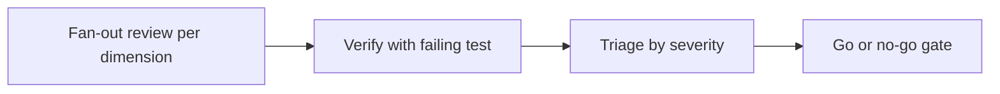

# Phase 6 — Security audit

Part of the Multi-Account epic — the [overview plan](/p/overview/) is the hub linking all phases.

Run an agent-driven, coverage-matrix security audit over everything phases 1a–5 built, block go-live on any Critical or High finding, and leave behind a standing CI regression guard so tenant isolation can never silently break later. This phase is part durable tooling and part repeatable process — a fan-out adversarial workflow whose every verified finding ships a regression test.

## Requirements

- An independent adversarial pass, driven by security-review agents, finds no way for one household to read another household's data.
- No path is found for a spouse to reach the other's private accounts, conversations, or workspace, including by coaxing the agent.
- Bank tokens and other secrets are confirmed safe at rest, in transit, and in logs, and no Critical or High finding is left open before real data flows.

## goal — Goal

Intensely audit the whole system so personal financial data cannot leak across households or between spouses, before and while real data is in use. The output is a verified findings report, a signed coverage matrix, and a permanent CI guard — with Critical and High findings blocking the flow of any real data beyond the owner's own household until they are fixed or explicitly risk-accepted in writing.

## method — The audit flow

A structured, agent-driven pass with verify-then-triage discipline. A fan-out workflow spawns one adversarial reviewer per coverage dimension for breadth; `rook` and the `/security-review` skill drive the highest-risk dimensions deeply; every candidate is then put through an independent skeptic pass and does not count until a failing test or concrete repro demonstrates it. Survivors are triaged by severity and driven to the go-live gate.

Detail lives in the sub-pages: the [coverage matrix](matrix.html) that drives the fan-out, the [CI regression guard](guard.html) that makes the guarantees permanent, and the [gate and deliverables](deliverables.html) that decide whether real data may flow.

## gate — The blocking gate

Every verified finding is scored Critical, High, Medium, or Low. Real data beyond the owner's own household cannot flow while any Critical or High is open — each is either fixed with a regression test proving the fix, or explicitly risk-accepted in a dated written record naming who accepted it and why. Medium and Low are tracked in a remediation ledger, non-blocking. This phase executes last, after phases 1a–5 are built, and is re-runnable after any major change. A full task-by-task implementation plan lives in the repo (`docs/superpowers/plans/2026-07-03-phase-6-security-audit.md`).
