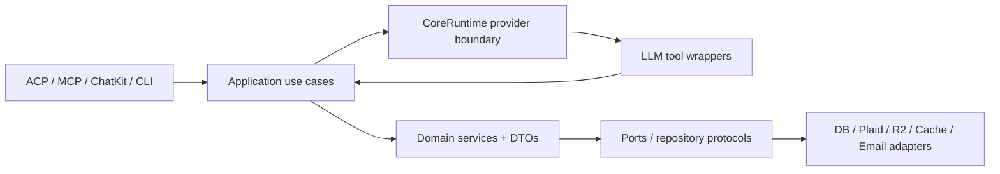

# Architecture Review

Created: 2026-05-10 20:51:06 America/New_York

## Executive Summary

Transactoid is structured as an AI-agent application with multiple frontends over a shared runtime/tool layer. The intended architecture is clear:

- UI frontends accept user prompts or tool requests.
- `Transactoid` assembles instructions, memory, taxonomy, schema hints, runtime provider config, and a `ToolRegistry`.
- Provider-specific runtimes stream normalized `CoreEvent` objects.
- Tools implement finance capabilities and call adapters for external systems and persistence.
- The database stores immutable source transactions plus mutable derived/enriched transactions.

The main architectural pressure is that the boundaries are not consistently enforced. Several modules recreate orchestration logic or pass provider/source-specific DTOs through generic layers. This makes behavior diverge by frontend and makes seemingly local changes in Plaid, Amazon matching, categorization, or storage ripple across unrelated components.

## Component Diagram

```mermaid
flowchart TB
    subgraph Clients["Clients / Entry Points"]
        Toad["Toad / ACP client"]
        Claude["MCP-compatible assistant"]
        Browser["ChatKit web frontend"]
        CLI["Typer CLI / cron commands"]
        Headless["Scheduled/headless reports"]
    end

    subgraph UI["Interface Layer"]
        ACP["ui.acp.server\nJSON-RPC session + prompt handlers"]
        MCP["ui.mcp.server\nFastMCP tool functions"]
        ChatKit["ui.chatkit.server\nFastAPI + ChatKit stream adapter"]
        CliMod["ui.cli\nTyper commands"]
    end

    subgraph App["Application / Orchestration"]
        AgentRun["services.agent_run.AgentRunService\nheadless run + continuation + artifacts"]
        Transactoid["orchestrators.Transactoid\ncomposition root for prompt, memory, runtime, tools"]
        Bootstrap["bootstrap.initialization\nmemory index hook"]
        Workspace["workspace\n~/.transactoid paths"]
    end

    subgraph Runtime["Provider Runtime Boundary"]
        CoreProtocol["core.runtime.protocol\nCoreRuntime + CoreEvent"]
        Factory["core.runtime.factory"]
        OpenAI["OpenAICoreRuntime"]
        Gemini["GeminiCoreRuntime"]
        ClaudeRt["ClaudeCoreRuntime"]
        LangGraph["LangGraphCoreRuntime"]
        ToolAdapters["runtime tool adapters\nOpenAI / Gemini / LangGraph"]
    end

    subgraph Tools["Tool / Use Case Layer"]
        Registry["ToolRegistry"]
        Sync["tools.sync.SyncTool\nPlaid sync + mutation + categorization"]
        Categorizer["tools.categorize.Categorizer\nLLM category assignment"]
        Persist["tools.persist.PersistTool\nmanual category + tags"]
        Migrate["tools.migrate.MigrationTool\ntaxonomy migrations"]
        Visualize["tools.visualize.GenerateChartTool"]
        AmazonScrape["tools.amazon.scraper"]
        StorageTool["tools.storage.upload_tool"]
    end

    subgraph Domain["Domain Support"]
        Taxonomy["taxonomy\nCategoryNode + loaders"]
        Rules["rules.MerchantRulesLoader"]
        Memory["memory.index_generation"]
        Prompts["promptorium prompts"]
    end

    subgraph Adapters["External / Persistence Adapters"]
        DB["adapters.db.DB facade"]
        DBModels["SQLAlchemy models"]
        Plaid["adapters.clients.PlaidClient"]
        Cache["adapters.cache.FileCache"]
        R2["adapters.storage.R2"]
        Amazon["adapters.amazon\nmatching + mutation plugin"]
        Email["services.email_service"]
    end

    subgraph Data["Data Stores / External Services"]
        SQL[("SQLite/Postgres\nplaid_transactions\nderived_transactions\ncategories\ntags\namazon_* tables")]
        PlaidAPI["Plaid API"]
        LLMs["OpenAI / Gemini / Claude / LangGraph models"]
        FS[("Workspace FS\nmemory, reports, cache, logs")]
        R2Bucket[("Cloudflare R2\nreports, traces, continuation state")]
        SMTP["SMTP provider"]
    end

    Toad --> ACP
    Claude --> MCP
    Browser --> ChatKit
    CLI --> CliMod
    Headless --> CliMod

    ACP --> Transactoid
    ChatKit --> Transactoid
    CliMod --> AgentRun
    AgentRun --> Transactoid
    MCP -. duplicates wiring .-> Sync
    MCP -. duplicates wiring .-> Persist
    MCP -. duplicates wiring .-> Migrate
    MCP -. duplicates wiring .-> Plaid

    Transactoid --> Bootstrap
    Transactoid --> Workspace
    Transactoid --> Prompts
    Transactoid --> Memory
    Transactoid --> Taxonomy
    Transactoid --> Rules
    Transactoid --> Registry
    Transactoid --> Factory

    Factory --> CoreProtocol
    Factory --> OpenAI
    Factory --> Gemini
    Factory --> ClaudeRt
    Factory --> LangGraph
    OpenAI --> ToolAdapters
    Gemini --> ToolAdapters
    LangGraph --> ToolAdapters
    ToolAdapters --> Registry
    Registry --> Sync
    Registry --> Persist
    Registry --> Migrate
    Registry --> Visualize
    Registry --> AmazonScrape
    Registry --> StorageTool

    Sync --> Plaid
    Sync --> DB
    Sync --> Categorizer
    Sync --> Amazon
    Sync --> R2
    Categorizer --> LLMs
    Categorizer --> Cache
    Categorizer --> Taxonomy
    Categorizer --> Rules
    Persist --> DB
    Migrate --> DB
    Migrate --> Categorizer
    Visualize --> FS
    AmazonScrape --> DB
    StorageTool --> R2

    DB --> DBModels
    DBModels --> SQL
    Plaid --> PlaidAPI
    Cache --> FS
    R2 --> R2Bucket
    AgentRun --> R2
    AgentRun --> StorageTool
    AgentRun --> LLMs
    Email --> SMTP
    Memory --> FS
    Workspace --> FS
```

## Primary Data Flows

### Interactive Agent Flow

1. ACP or ChatKit receives a user prompt and creates or resumes a session.
2. The UI calls `Transactoid.create_runtime()`.
3. `Transactoid` loads prompt templates, DB schema hints, taxonomy, taxonomy rules, memory files, and optional skill instructions.
4. `create_core_runtime()` selects OpenAI, Gemini, Claude, or LangGraph from `CoreRuntimeConfig`.
5. The runtime streams normalized events through `CoreRuntime.run_streamed()`.
6. Tool calls go through runtime-specific adapters into `ToolRegistry.execute()`.
7. Tools execute finance operations through `DB`, `PlaidClient`, `FileCache`, R2, and local workspace files.
8. UI-specific handlers convert `CoreEvent` objects to ACP or ChatKit stream events.

### Plaid Sync Flow

1. `sync_transactions` calls `SyncTool.sync()`.
2. `SyncTool` loads `PlaidItem` rows and runs per-item sync concurrently.
3. For normal transactions, Plaid pages are normalized into source rows, persisted to `plaid_transactions`, mutated into derived rows, categorized, and written to `derived_transactions`.
4. For investment transactions, `SyncTool` fetches investment pages, normalizes them into Plaid-like source rows, performs cross-source dedupe, writes source and derived rows, updates reporting mode, archives duplicates to R2, and advances the watermark.
5. Categorization calls `Categorizer`, which renders promptorium prompts with taxonomy/rules, calls OpenAI or Gemini, parses structured JSON, and writes category provenance through DB bulk update methods.

### Headless Report Flow

1. CLI report commands build an `AgentRunRequest` and call `AgentRunService.execute()`.
2. `AgentRunService` optionally downloads continuation state and trace from R2.
3. It creates a `Transactoid` runtime and executes a non-streaming run.
4. It persists trace and session-state artifacts to R2.
5. `OutputPipeline` can render HTML with Gemini and fan out markdown/HTML to local files or R2.
6. Email service can send generated report artifacts.

## Boundary Review Findings

### 1. MCP bypasses the shared orchestration path

`src/transactoid/ui/mcp/server.py` initializes `DB`, taxonomy, merchant rules, categorizer, persist tool, migration tool, and each MCP tool at import time, then calls domain tools directly. ACP and ChatKit instead go through `Transactoid` and the `ToolRegistry`.

Why this matters:

- Tool definitions, parameter names, error shapes, default arguments, and initialization behavior can diverge by frontend.
- Module import has side effects: DB connection, taxonomy load, memory initialization, and categorizer construction happen before any request.
- Runtime-independent tool composition is no longer in one place.

Evidence:

- `src/transactoid/ui/mcp/server.py:31` starts global service initialization.
- `src/transactoid/ui/mcp/server.py:54` defines a separate `sync_transactions` path.
- `src/transactoid/orchestrators/transactoid.py:514` is the intended composition root.
- `src/transactoid/orchestrators/transactoid.py:209` registers the runtime-backed `sync_transactions` wrapper.

Recommended direction:

- Make MCP adapt the same `ToolRegistry` produced by `Transactoid` instead of reimplementing tools.
- Keep MCP responsible for protocol decoration and serialization only.

### 2. `Transactoid` is both composition root and tool implementation module

`orchestrators/transactoid.py` contains prompt rendering, memory assembly, runtime creation, and private concrete tool classes for SQL, Plaid connection, sync, recategorization, tags, taxonomy migration, Amazon scraping, and memory-index generation.

Why this matters:

- The orchestrator is hard to test as a composition unit because it also contains business-facing tool behavior.
- Adding or changing a tool requires editing the global agent composition file.
- Several tool wrappers duplicate classes that already exist in feature modules, such as `RecategorizeTool` and `TagTransactionsTool` in `tools.persist.persist_tool`.

Evidence:

- `src/transactoid/orchestrators/transactoid.py:118` begins private tool classes inside the orchestrator module.
- `src/transactoid/orchestrators/transactoid.py:445` includes interactive Amazon scraping with `print()` and `input()` inside a runtime tool.
- `src/transactoid/tools/persist/persist_tool.py` already has reusable tool wrappers for persist operations.

Recommended direction:

- Move tool wrappers to their feature packages and expose `build_*_tools(...)` factories.
- Keep `Transactoid` focused on dependency construction and registry assembly.
- Model interactive browser setup as a frontend-mediated capability, not a generic runtime tool that blocks on stdin.

### 3. The DB facade knows too much about upstream DTOs and ingestion sources

The DB facade is described as a database service layer, but `save_transactions()` accepts `CategorizedTransaction` objects from the categorizer and unpacks Plaid-shaped transaction dicts directly. It also hardcodes source defaults and contains legacy wrappers that create both source and derived rows.

Why this matters:

- Persistence depends on categorizer internals and Plaid DTO shape, so changing categorization or adding CSV/other ingest requires DB facade changes.
- The facade mixes repository concerns with source normalization and application workflow decisions.
- The “immutable source plus derived transaction” invariant is blurred by legacy wrappers.

Evidence:

- `src/transactoid/adapters/db/facade.py:8` imports `CategorizedTransaction` for typing.
- `src/transactoid/adapters/db/facade.py:598` accepts categorized transactions directly.
- `src/transactoid/adapters/db/facade.py:634` maps Plaid-style transaction dict fields inside the DB layer.
- `src/transactoid/adapters/db/facade.py:638` hardcodes `source = "PLAID"`.
- `src/transactoid/adapters/db/facade.py:404` and `src/transactoid/adapters/db/facade.py:449` retain deprecated wrappers.

Recommended direction:

- Introduce application-level normalized command DTOs such as `SourceTransactionUpsert`, `DerivedTransactionUpsert`, and `CategoryAssignment`.
- Move Plaid/categorizer mapping out of `DB` into sync or ingestion services.
- Narrow `DB` to repository operations over explicit persistence DTOs and ORM models.

### 4. `SyncTool` owns too many subdomains

`SyncTool` coordinates Plaid transaction sync, investment transaction sync, mutation registry setup, Amazon order mutation, categorization, R2 archival, cursor/watermark management, and database persistence. This is a use-case workflow, but the current class crosses adapter, domain, and infrastructure concerns directly.

Why this matters:

- Investment handling, Amazon mutation, R2 archival, and category assignment cannot evolve independently.
- The sync path is difficult to test without broad mocks.
- Adding a new source or mutation plugin pushes more conditional behavior into the sync class.

Evidence:

- `src/transactoid/tools/sync/sync_tool.py:252` hardwires Amazon mutation plugin registration.
- `src/transactoid/tools/sync/sync_tool.py:379` starts a large investment sync workflow inside `SyncTool`.
- `src/transactoid/tools/sync/sync_tool.py:594` imports R2 archive support from inside sync logic.
- `src/transactoid/tools/sync/sync_tool.py:659` categorizes derived transactions by mapping ORM rows back into Plaid-shaped transaction dicts.

Recommended direction:

- Split sync into smaller use-case services: `PlaidTransactionSync`, `InvestmentTransactionSync`, `DerivedMutationPipeline`, and `CategorizationPipeline`.
- Inject mutation plugins rather than registering Amazon from inside `SyncTool`.
- Emit normalized source/derived persistence commands rather than ORM-to-Plaid DTO conversions.

### 5. Runtime/provider configuration leaks into categorization

`Categorizer` resolves provider/model by calling `load_core_runtime_config_from_env()`, which also validates credentials for the whole agent runtime. Categorization is a tool-level capability, but it depends on runtime-level configuration and can fail due to unrelated provider credentials.

Why this matters:

- The categorizer cannot be configured independently of the agent runtime without environment coupling.
- Tests and scripts that only need categorization inherit agent provider validation behavior.
- Provider parity is inconsistent: the agent runtime supports Claude as a provider shape, while the categorizer explicitly fails for Claude.

Evidence:

- `src/transactoid/tools/categorize/categorizer_tool.py` imports `load_core_runtime_config_from_env`.
- `src/transactoid/tools/categorize/categorizer_tool.py` resolves categorizer defaults through runtime config.
- `src/transactoid/tools/categorize/categorizer_tool.py` raises at runtime when Claude is selected.

Recommended direction:

- Define a separate `CategorizerConfig` loaded from `TRANSACTOID_CATEGORIZER_*` with explicit fallback rules.
- Pass provider clients or provider adapters into `Categorizer` instead of constructing SDK clients internally.

### 6. Protocol adapters and UI presenters depend on core runtime details in both directions

The normalized `CoreEvent` layer is a useful seam, but UI modules still need detailed knowledge of runtime event variants, runtime metadata, and tool payload presentation. Separately, `adapters/acp_adapter.py` imports ACP notifier types from `ui.acp`, which makes an adapter package depend on a concrete UI implementation.

Why this matters:

- The “adapter” layer is not purely external infrastructure; it depends on UI concerns.
- Adding a new frontend likely requires copying event-state handling from ACP or ChatKit.
- Tool display semantics live in UI rather than a shared presentation boundary.

Evidence:

- `src/transactoid/ui/acp/handlers/prompt.py` switches on many `CoreEvent` classes.
- `src/transactoid/ui/chatkit/server.py` implements a separate, smaller event adapter.
- `src/transactoid/adapters/acp_adapter.py` imports `transactoid.ui.acp.notifier` types.

Recommended direction:

- Create a shared `presentation` or `event_projection` layer that turns `CoreEvent` streams into frontend-neutral display records.
- Keep ACP/ChatKit responsible only for protocol-specific serialization.
- Move `adapters/acp_adapter.py` under `ui/acp` or invert it to avoid adapter-to-UI coupling.

### 7. Packaging contains a second top-level `models` package outside `src/transactoid`

The Plaid transaction TypedDict lives in top-level `models/transaction.py` and is imported by adapters, tools, tests, and DB-related code. This weakens package encapsulation and creates two model namespaces: SQLAlchemy DB models under `transactoid.adapters.db.models` and Plaid DTO models under top-level `models`.

Why this matters:

- `models` is generic and can collide with other packages.
- It obscures whether a “model” is a DB entity, external DTO, or domain object.
- The package boundary is split outside `transactoid`, even though the DTO is application-specific.

Evidence:

- `models/transaction.py` defines the Plaid-shaped `Transaction` TypedDict.
- `src/transactoid/tools/sync/sync_tool.py:12` imports it from `models.transaction`.
- `src/transactoid/tools/categorize/categorizer_tool.py` imports the same top-level package.
- `src/transactoid/adapters/clients/plaid.py` imports the same top-level package.

Recommended direction:

- Move external DTOs to `transactoid.adapters.clients.plaid_types` or `transactoid.domain.transactions`.
- Reserve `adapters.db.models` for ORM entities.

## Architectural Strengths

- The `CoreRuntime` protocol and `CoreEvent` normalization are good seams for provider independence.
- `ToolRegistry` is the right abstraction for exposing the same capabilities across runtimes.
- The two-table transaction model has a defensible core invariant: immutable source rows and mutable derived rows.
- Category provenance is modeled explicitly with `transaction_category_events`.
- Memory/workspace concerns are mostly isolated and path resolution is centralized.
- Tests cover many layers: runtime adapters, ACP handling, DB facade behavior, sync investment dedupe, taxonomy migration, and agent-run state.

## Target Architecture

A cleaner architecture would make the following boundaries explicit:

- Interface layer: ACP, MCP, ChatKit, CLI. Own protocol serialization only.
- Application layer: use-case services like `RunAgent`, `SyncPlaidTransactions`, `MigrateTaxonomy`, `GenerateReport`.
- Runtime layer: provider adapters and normalized event stream.
- Tool layer: thin LLM-callable wrappers around application services.
- Domain layer: taxonomy, category assignment, merchant rules, normalized transaction concepts.
- Adapter layer: DB repositories, Plaid client, R2, cache, email, browser/Amazon integrations.

## Prioritized Refactor Plan

1. Unify MCP through `Transactoid` and `ToolRegistry` first. This removes the largest frontend drift risk with limited domain changes.
2. Move private tool wrapper classes out of `orchestrators/transactoid.py` into feature modules and keep the orchestrator as a composition root.
3. Introduce normalized persistence DTOs and stop passing `CategorizedTransaction`/Plaid dicts into `DB`.
4. Split `SyncTool` into Plaid source sync, investment source sync, mutation pipeline, and category assignment pipeline.
5. Separate `CategorizerConfig` from `CoreRuntimeConfig`.
6. Move top-level `models.transaction` into the `transactoid` package and clarify DTO naming.
7. Extract shared event projection/presentation for ACP and ChatKit.
