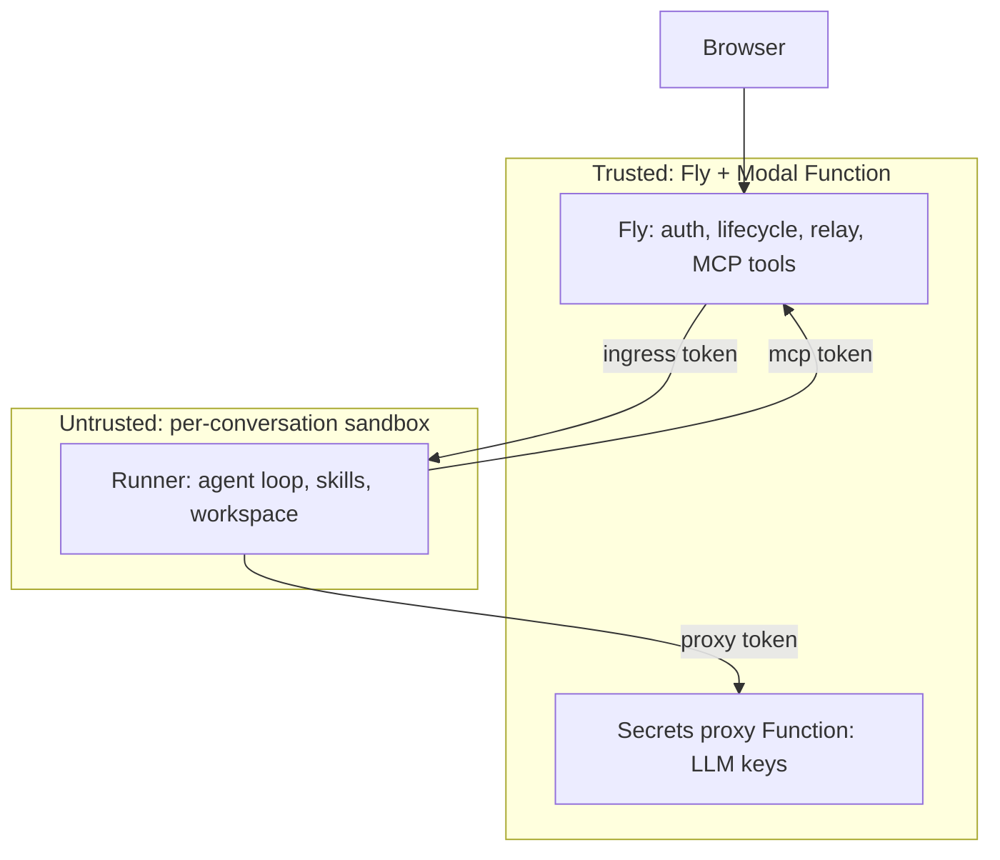

# Four planes, three tokens, two resumable hops

Who runs what, who may talk to whom, and the decisions that fix the shape — each traced to the reference implementation it came from.

## Requirements

- A reader can tell, for any piece of code or credential, exactly which plane it lives on and why it cannot live anywhere else.
- Each connection in the system names its authentication and its reconnect story.
- Every non-obvious decision records the alternative that was rejected and the reference design that tipped it.

## planes — The four planes

**Browser** — unchanged. AI SDK `useChat` speaking the UI message-stream protocol over SSE, plus a new resume endpoint it calls on mount.

**Fly server (trusted orchestrator)** — the existing FastAPI app, extended with four responsibilities: authenticate the user (Clerk `RequestContext`) and gate the turn (billing gate); manage sandbox lifecycle — create/restore, snapshot, record `{sandbox_id, snapshot_image_id, tunnel_url, tokens}` per conversation; relay and translate the event stream (the existing `bridge.py` translation and persistence stay here, unchanged in role); and host the MCP tool server where all finance tools actually execute.

**Modal sandbox (per conversation)** — runs the new *runner*: an HTTP server (behind a Modal encrypted tunnel) that owns the agent-harness `Agent`, the skills tree, and the `/workspace` filesystem. It executes no finance operations and holds no secrets — only conversation-scoped capability tokens: an ingress token (Fly to runner), an MCP token and a turn-result callback token (runner to Fly), and a proxy token (runner to LLM proxy).

**Modal Function proxy (secrets holder)** — a deployed ASGI Function holding the real LLM API keys as Modal Secrets, injecting them into upstream calls after validating the caller's capability token.

## decisions — Decisions and their provenance

| Decision | Chosen | Rejected alternative | Tipped by |
| --- | --- | --- | --- |
| Runner process model | HTTP server behind a tunnel port, launched as the sandbox entrypoint | `sb.exec()` subprocess with stdout wire | Modal: exec output cannot be re-attached by a new client; tunnels can. Vercel's detached-command reattach is the model. |
| Fly-to-sandbox stream | Fly *pulls* SSE from the runner's per-turn event log with `from_seq` | Runner pushes events to a Fly callback URL | Cloudflare's buffered-stream replay plus Temporal's offset-resumable streams; pull keeps the sandbox free of Fly-side auth and retry logic. |
| Where events become UI frames | On Fly (existing `bridge.py` plus accumulator unchanged) | Runner emits AI SDK frames directly | Keeps translation and persistence in the website domain where they live today; the wire carries harness events via a small codec. |
| Tool execution | All finance tools behind an MCP server on Fly; filesystem/skills stay local to the sandbox | Tools in-sandbox with a scoped DB credential | Your call (all tools via MCP). Bonus: the sandbox image drops the whole finance dependency stack. |
| LLM credentials | Modal Function proxy, capability-token auth, key injection at egress | Keys in sandbox env; or Modal's experimental Caddy sidecar | Cloudflare Outbound Workers / Vercel credential-brokering; sidecars rejected as experimental and per-sandbox-costly. |
| Snapshot unit | `snapshot_directory('/workspace')`, one image per conversation, mounted into a fresh base sandbox on restore | Full `snapshot_filesystem()` as the next boot image | Modal: directory deltas are smaller, and the base image can be upgraded independently of live conversations. |
| Idle teardown | Fly-owned reaper snapshots once, then terminates, at 15 idle min; a cancellable reap lease lets a returning turn steal the box back | Eager snapshot at each turn end, relying on Modal's `idle_timeout` to terminate | Modal's idle timer has no pre-termination hook, so it can't snapshot-before-kill — Fly must own the reaper. Lazy also keeps the committed snapshot quiescent, dissolving the torn-snapshot problem. |
| Turn durability | Runner POSTs an authoritative turn-result callback to Fly on each successful turn | Rely on streamed frames alone; or eager per-turn snapshots | Closes lazy snapshotting's crash gap for results without per-turn Modal snapshots, leaving only ephemeral scratch at risk. |
| Resume granularity | Whole-turn replay on both hops | Offset resume (Last-Event-ID) | Your call; Cloudflare buffers-then-replays similarly. Sequence numbers still exist on the wire, so offset resume is a later optimization, not a redesign. |

## references — What each reference contributed

- **Cloudflare** — the resumable-stream contract (server keeps generating on disconnect; reconnect replays the buffer then goes live) and enforced credential injection at an egress proxy. Their caveat also transfers: an open tunnel connection counts as sandbox activity on Modal too, so Fly must close its SSE pull between turns or the 15-minute idle clock never starts.
- **Vercel** — the two-level identity (durable named thing vs. running instance): our conversation record holding `{snapshot_image_id, tokens}` is the durable thing; the Modal sandbox is the disposable session. Also `onCreate`/`onResume` as distinct hooks: base-image setup vs. per-restore rehydration.
- **sandbox-cli** (secondary) — capability tokens over keys, the runner-holds-no-key proxy (its v2 `LocalProxyBroker`), per-turn event logs with sequence numbers, and the warning that agent output integrity matters (we inherit its answer for free: the runner's event channel is a dedicated HTTP stream, never a shared stdout).
- **Temporal** (idea theft only) — the event log as the durable unit of a turn, with subscribers resuming by offset. We implement the 20% that fits: the runner's turn log is the source of truth Fly can always re-pull.
