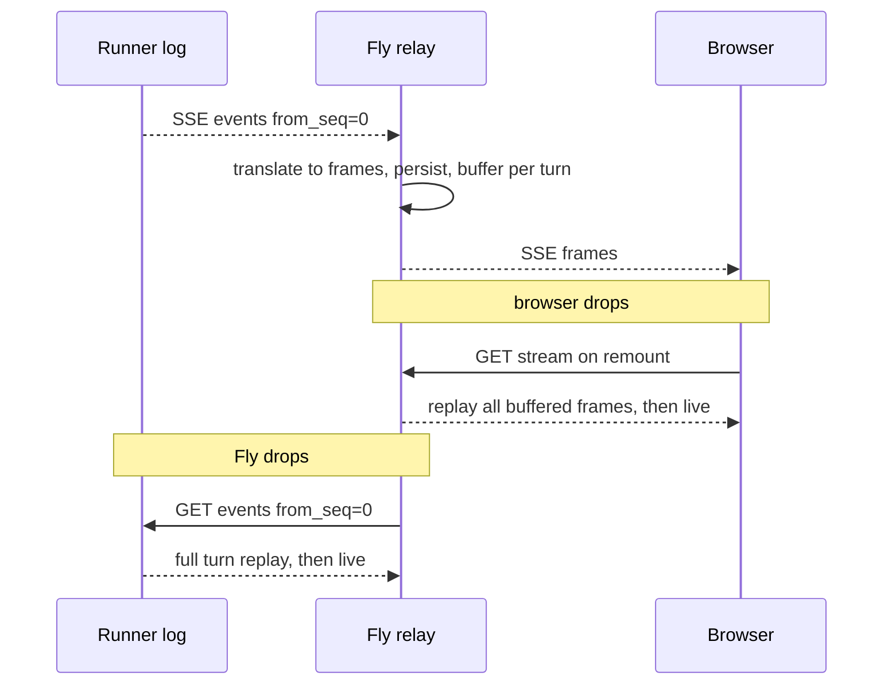

# Event stream and resume

One event log in the sandbox, one frame buffer on Fly, whole-turn replay on both hops. A disconnect anywhere costs a re-send, never a lost answer.

## Requirements

- A user who refreshes mid-answer sees the full in-progress answer replay immediately and then continue streaming live.
- If the web server restarts mid-turn, it can rebuild everything it was streaming by asking the sandbox again; the user reconnects and sees the same replay.
- The streaming format the browser sees today does not change at all.

## wire-protocol — The sandbox-side turn log (source of truth)

The runner subscribes to the harness `EventBus` exactly as `bridge.py` does today, but instead of translating, it **appends each event to an in-memory turn log** with a monotonically increasing `seq`. The runner's HTTP surface:

- `POST /turns` — starts a run, returns `run_id`. One active run per sandbox; `409` otherwise.
- `GET /runs/{run_id}/events?from_seq=N` — SSE of `{seq, event}` envelopes from N, then live until `RunEnd`. Any number of sequential re-connections; each replays from the requested offset. This is the Vercel `getCommand(cmdId).logs()` shape with Temporal's offset semantics.
- `POST /runs/{run_id}/cancel` — aborts the in-flight run. The browser "stop" button routes through Fly to here; the runner cancels the harness run and flushes a terminal event to the log, so a concurrent reader still sees a clean close and Fly stops the model spend at the proxy.
- `GET /healthz` — readiness probe target.

The log lives for the duration of the turn plus a grace window (until Fly confirms turn-end processing and the runner's turn-result callback has fired, at which point the log is dropped). Memory bound: one turn's events — the same data the accumulator holds on Fly today. The workspace snapshot is *not* taken here — that happens lazily at idle-reap (see the Turn lifecycle page).

## event-codec — Event codec (the one new protocol artifact)

Harness events are frozen dataclasses with *no* built-in JSON round-trip, so the shared protocol package owns a versioned codec: tag-to-dataclass dispatch over the roughly 29-member `Event` union, with pydantic payloads (`Message`, `Usage`, content blocks) delegating to `model_dump`/`model_validate`.

- Two members need special-casing: `Error.cause` (an exception *type* — serialized as its qualified name string) and `RunEnd.result` (dropped from the wire; Fly's accumulator never used it — the persisted parts are built from the streamed events).
- The envelope is versioned (`{v, seq, event_type, payload}`); an unknown event type is relayed as an opaque error frame rather than killing the stream — same defensive posture as `_translate`'s per-event try/except today.
- Candidate upstream contribution: this codec is exactly what agent-harness's promised `SqliteEventBus` replay will need; building it as a clean module keeps the door open to moving it into the harness later.

## fly-resume — Fly-to-sandbox resume

If Fly's SSE pull drops (network blip, Fly deploy, process restart), the turn keeps running in the sandbox — the runner neither notices nor cares. Recovery, in order of what Fly knows:

- **Same process, transient drop:** re-GET with `from_seq=0` (whole-turn replay, per the simplicity decision). Translation and persistence are idempotent because the accumulator rebuilds from a full event replay and `_safe_persist` upserts by `run_id`.
- **Fly restarted mid-turn:** the conversation record holds `{sandbox_id, tunnel_url}` and the persisted assistant row holds the in-flight `run_id` with status `streaming`. A reconciler sweep on startup (or lazily on the next client request) re-attaches to any streaming-status run and resumes relaying from seq 0.
- **Sandbox actually died mid-turn:** the re-attach fails; Fly finalizes the assistant row as `error` — exactly today's failure semantics, now scoped to real sandbox death rather than any dropped connection.

## browser-resume — Browser-to-Fly resume

Fly keeps a **per-run frame buffer**: the translated AI SDK frames for the in-flight turn, in order (in-memory, keyed by conversation; bounded to one turn). Two endpoint changes:

- `POST /api/chat` — unchanged contract; internally it now also registers the run in the frame buffer as frames are produced.
- `GET /api/chat/{id}/stream` (new) — if a run is in flight for this conversation: replay every buffered frame, then continue live from the shared relay. If not: `204`. The frontend calls it on mount (AI SDK `useChat` resume support), which also covers the page-refresh case that today loses the live run.
- The turn's frames are droppable the moment the run finalizes — after that, rehydration is the existing `GET /api/sessions/{id}` path from persisted parts.

This is Cloudflare's buffered-stream contract implemented at whole-turn granularity: the server never stops generating because a client went away, and reconnect equals replay plus live. Multi-tab falls out for free: each subscriber gets the same replay-then-live view.
