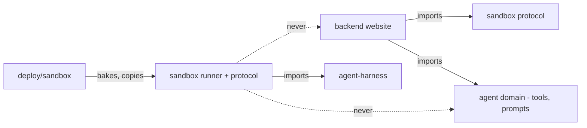

# Packaging and segregation

The sandbox runner is a sixth domain: a new top-level package with its own dependencies and deployable, related to the rest of the repo only through a small shared protocol and the env contract.

## Requirements

- Someone reading the repo can tell at a glance which code runs inside the sandbox, and that code imports nothing from the website or the finance tools.
- The sandbox image can be rebuilt and redeployed without touching the web app, and vice versa.
- An automated test fails the build if anyone wires a forbidden import across the boundary.

## layout — Repository layout

```text
sandbox/                        # NEW top-level: code that runs inside the Modal sandbox
  pyproject.toml                # own uv project; deps: agent-harness[mcp], model SDK, fastapi
  runner/                       # the runner server package
    server.py                   #   POST /turns, GET /runs/{id}/events, /healthz
    agent_assembly.py           #   turn payload -> harness Agent (toolsets, provider @ proxy)
    turn_log.py                 #   per-turn event log with seq
  protocol/                     # shared wire types: turn payload schema, event codec, envelopes
                                #   (importable by backend/ too — the ONE shared code seam)

backend/penny/api/mcp_server.py # NEW: MCP adapter exposing toolsets, mounted on FastAPI
backend/penny/sandboxes/        # NEW website module: Modal lifecycle (create/restore/snapshot),
                                #   the idle reaper (snapshot+terminate state machine), the
                                #   turn-result persist endpoint, conversation-sandbox records,
                                #   frame buffer, relay client

deploy/sandbox/                 # NEW deploy target: Modal app definitions + image bake
  modal_app.py                  #   image (uv_sync from sandbox/), sandbox App, deploy entry
  proxy_app.py                  #   the secrets-proxy Function app
  README + scripts              #   modal deploy, image prebuild, env template
```

Naming note: `sandbox/` at top level mirrors `backend/` and `frontend/`; the runner never calls itself "penny" — it is agent-runtime shell, not product code. Skills (`backend/.agent/skills`) remain owned by the agent domain and are *copied into the image at bake time* by `deploy/sandbox` (deploy to app direction, same as Dockerfiles COPY today).

## dependency-rules — Dependency rules (extending the existing hard constraints)



- **`sandbox/` imports agent-harness and its own protocol only.** Never `penny.*` — not tools, not adapters, not config. Everything conversation-specific arrives in the turn payload (rendered prompt, seed, URLs, tokens).
- **`backend/` may import `sandbox/protocol`** (to encode turn payloads and decode events) but never `sandbox/runner`. The protocol package is deliberately tiny and dependency-light (pydantic only) so this seam stays thin.
- **`deploy/sandbox` follows the deploy-domain rule**: it copies from `sandbox/` and `backend/.agent/skills` and supplies env; nothing under `sandbox/` or `backend/` reads a Modal app file. The backend learns the proxy URL, Modal app name, and base image id via `PENNY_*` env vars — the existing single cross-domain seam.
- **The runner is not a front door.** Like the Typer CLI rule: Fly (website) drives the runner; the runner never calls back into website endpoints other than the two capability-scoped callbacks it was handed — the MCP tool path and the turn-result persist path. Both are Fly-issued and conversation-scoped; the runner cannot reach anything else.

## guardrails — Guardrails

- Extend the existing segregation test suite with: nothing under `sandbox/` imports `penny`; `backend` imports from `sandbox.protocol` only; `deploy/` is imported by no one.
- The runner's dependency lock is its own file; a CI check fails if the sandbox image's resolved dependencies include any of a denylist (`sqlalchemy`, `plaid`, `boto3`, `psycopg`) — the "thin image" property enforced, not hoped for.
- `REQUIREMENTS.txt` gains the new invariants in the same change: sandboxed loop, no secrets in sandbox, tools over MCP, 15-minute idle teardown with snapshot restore, whole-turn stream replay.
