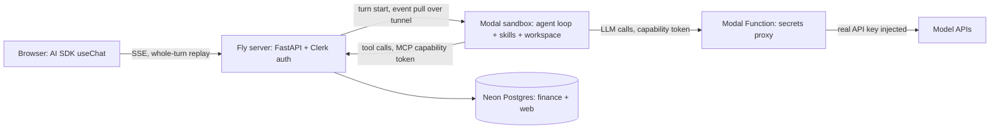

# Penny on Modal: sandboxed agent loop

Move each chat turn's agent loop into a per-conversation Modal sandbox. The Fly server becomes the trusted middle: it authenticates the user, relays a resumable event stream, serves every finance tool over MCP, and never lets a secret into the sandbox.

## Requirements

- A user chats with Penny exactly as today — same UI, same streaming feel — while the agent actually runs inside an isolated sandbox in the cloud.
- If the user refreshes the page or loses connectivity mid-answer, reconnecting replays the whole in-progress answer and then continues live; nothing is lost.
- No key that unlocks money-adjacent data or paid APIs ever exists inside the sandbox; a fully compromised sandbox can only act as that one conversation's tenant.
- A conversation left idle for fifteen minutes stops costing compute; returning to it later feels like it never left, because its workspace was snapshotted and restored.
- The code the sandbox runs is its own top-level package and deployable, cleanly separated from the frontend, the website backend, and the agent's finance tools.

## goal — The goal

Today the agent loop runs in-process on the Fly web server with an `InProcessSandbox`: model calls, tool execution, and file work all share the web app's process, credentials, and disk. This plan moves the *loop* — the agent-harness `Agent`, its skills, and its filesystem workspace — into a per-conversation **Modal sandbox** (gVisor-isolated), while pulling two things *out* of it.

**Tool execution** moves behind an MCP server on Fly. The sandbox calls tools over MCP; `run_sql`, Plaid sync, and the categorizer execute on the trusted side with tenancy enforced per request. The sandbox needs no database credential at all.

**LLM credentials** move behind a Modal Function proxy that injects the real API key at the egress boundary — the pattern Cloudflare's Outbound Workers and Vercel's firewall credential-brokering both converged on.

The result is a sandbox that holds *zero long-lived secrets* — only conversation-scoped, revocable capability tokens.

## topology — Topology

Every hop is authenticated and every hop is resumable. The browser never talks to the sandbox; the sandbox never talks to the database; the model keys never leave the proxy. Full walk-throughs of each flow are on the Turn lifecycle and Event stream pages.

## strategy — Strategy

Three prior designs anchor the decisions, in the priority you set: **Cloudflare** (server-side stream buffering with replay-on-reconnect; credential injection at a programmable egress proxy), **Vercel** (named persistent sandboxes; auto-snapshot on stop; re-attach to a detached command's logs from any later process), and secondarily **sandbox-cli** (capability tokens instead of keys; the runner-holds-no-key proxy; event logs with sequence numbers). Temporal contributes one idea we borrow cheaply: the event log with offset-based resume as the unit of durability for a turn.

The plan lands in six phases — protocol first, then the MCP tool server, then the proxy, then Modal lifecycle, then resume, then hardening — each with its own verification gate.

Two structural choices do most of the work. **The runner is a server, not a subprocess.** Modal exec streams cannot be re-attached after a client disconnect, but a tunnel-exposed HTTP server can be reconnected to at will. The runner exposes a tiny turn API and an event log; Fly pulls events with `from_seq`, so a Fly restart mid-turn recovers by re-pulling from zero. **MCP makes the sandbox thin.** Because finance tools execute on Fly, the sandbox image needs agent-harness, the MCP client, and one model SDK — not SQLAlchemy, Plaid, or the categorizer stack.

## tradeoffs — The big tradeoffs

- **Every tool call is now a network hop** (sandbox to Fly over MCP). Acceptable: tool latency is dominated by the work itself (SQL, Plaid) and by model latency, so the added hop is negligible — not a measured gate — and it buys total secret removal.
- **Whole-turn replay over fine-grained resume.** Reconnect replays the entire in-flight turn rather than resuming at an offset. Simpler on every layer (buffer per turn, replay from zero, discard at turn end) at the cost of re-sending at most one turn's frames.
- **Lazy snapshots plus per-turn result persistence, not eager snapshots.** The workspace is snapshotted once, when a conversation is reaped after 15 idle minutes; per-turn results are made durable by a runner-to-Fly callback the instant each turn finishes, so a crash loses at most ephemeral scratch, never a completed turn. This also keeps the committed snapshot quiescent, sidestepping the torn-snapshot problem an eager per-turn snapshot would have. Memory snapshots stay off the table — alpha, terminate-on-snapshot, 7-day non-renewable expiry.
- **A sixth domain.** The runner package adds a new top-level package and deployable with its own dependency rules. That is deliberate scope: the segregation is the security property.

Everything assumed or unresolved is on the Assumptions page; the threat model is on the Security model page.
