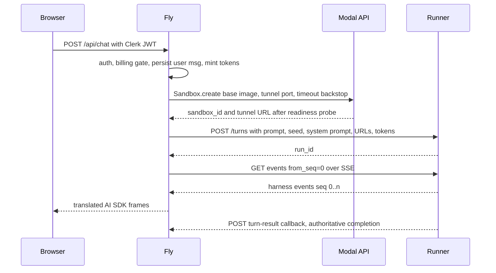
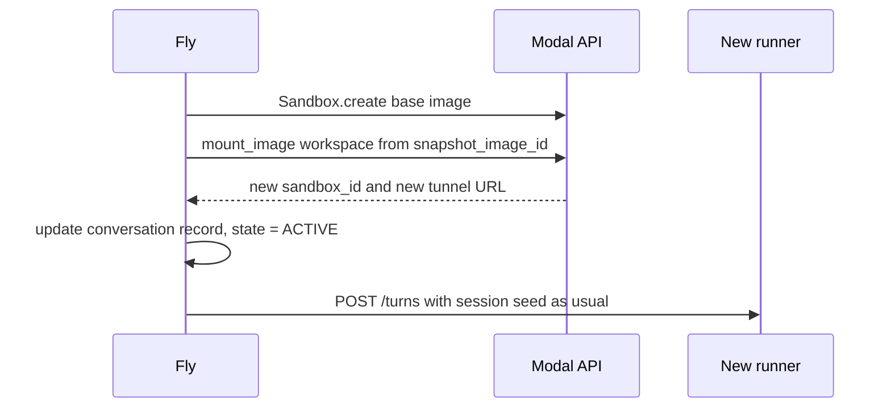
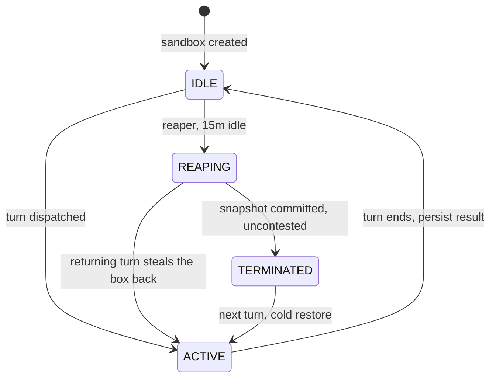

# Turn lifecycle

The four paths a chat message can take — cold conversation, warm sandbox, restore from snapshot — plus the two things that make the sandbox disposable: a turn-result callback that persists every completed turn, and a Fly-owned reaper that snapshots once, at teardown.

## Requirements

- The first message of a brand-new conversation gets an answer without the user perceiving setup work beyond a short first-token delay.
- A follow-up message within fifteen minutes reuses the live sandbox with no provisioning cost at all.
- Every completed turn's results are durable the instant it finishes, so a sandbox crash never loses a turn the user already saw answered.
- A message after a long absence restores the conversation's workspace close to how the agent left it.
- An abandoned conversation stops billing within fifteen minutes without losing any completed-turn results.

## fresh-turn — Fresh conversation (cold path)



Details that matter:

- **Fly renders the system prompt.** The template needs the DB schema snapshot, taxonomy, and agent memory — all trusted-side data — so it is rendered on Fly and passed in the turn payload, keeping the sandbox free of every finance dependency. Because memory is rendered on Fly and injected, it is never sandbox-workspace-durability-dependent.
- **Session seed travels with the turn.** Prior messages come from the conversation store (as `_seed_session` does today) and ride the `POST /turns` body; the runner loads them into an in-memory harness session. The runner never reads the database.
- **The runner is told where to call back.** The turn payload carries the MCP URL, the proxy URL, and the persist URL, each with its capability token. The persist callback fires at the end of every turn — cold or warm.
- **No idle_timeout-driven teardown.** The sandbox is created with a generous max-lifetime `timeout` backstop only; the 15-minute idle teardown is owned by Fly's reaper, because Modal's own idle timer has no pre-termination hook to snapshot before it kills the box.
- **Inbound/outbound lockdown** as on the Security model page: `inbound_cidr_allowlist` pinned to Fly, `outbound_domain_allowlist` pinned to the proxy and MCP hosts.

## warm-turn — Subsequent turn (warm path)

The conversation record holds `{sandbox_id, tunnel_url, tokens, state}`. Fly transitions the conversation to `ACTIVE` under a row lock (which also cancels any in-flight reap — see the Idle reaper section), then POSTs the next turn directly to the same runner. No Modal control-plane work; the runner appends to its live harness session, so context is already in memory. Latency added versus today: one HTTP round-trip to the tunnel. As on the cold path, the turn ends with the runner's persist callback.

Concurrency guard: the runner accepts one active run per sandbox and returns `409` for a second concurrent turn — a per-conversation lock that matches the chat UI. This also means turns within a conversation never execute concurrently, which is what makes the reaper's state machine tractable.

## turn-persist — Turn-result persistence (the durability floor)

Because the workspace is now snapshotted only lazily (at reap), a crash mid-session would otherwise lose every workspace delta back to the last reap. We close that gap by decoupling *result* durability from the snapshot: after every successful turn, the runner POSTs the turn's results to Fly. Three durability tiers, each with a clear owner and failure mode:

- **Transcript (Tier 1)** — the translated frames (assistant message, tool outputs) are persisted by the relay as they stream, exactly as today. Safe the instant they are streamed.
- **Turn result (Tier 2, new)** — `POST /internal/turns/{run_id}/result` on Fly, called by the runner harness after `RunEnd`, before it returns to idle. It carries an *authoritative* completion marker (so Fly knows the turn finished rather than inferring it from a stream that might merely have dropped) plus any durable workspace artifact the turn produced that is not already a streamed tool result. Idempotent by `run_id`; authenticated by a conversation-scoped callback capability token (same minting as the MCP token). On failure the runner retries with backoff; if it ultimately fails, Tier 1 still holds the transcript, so Tier 2 is a strengthening, never the sole record.
- **Workspace snapshot (Tier 3)** — taken lazily by the reaper at teardown, one per conversation. Pure warm-restore optimization for scratch files; its loss degrades to rehydration from Tiers 1 and 2, not data loss.

Net effect: a completed turn is durable the moment it finishes, independent of when (or whether) the workspace is ever snapshotted. Lazy snapshotting's only remaining exposure is ephemeral scratch since the last reap — files the agent made and no future turn needs.

## restore — Turn after teardown (restore path)



- The workspace comes back from the conversation's last reap snapshot; the harness session is rebuilt from the seed exactly as on the cold path — the runner treats "cold" and "restore" identically except for the pre-populated workspace.
- The snapshot may be stale (it reflects the state at the last idle-reap, not the last turn) or absent (first session, or expired past Modal's 30-day image TTL). That is *safe*, not an error: conversation context comes from the seed and completed results from Tier 2, so a missing or stale snapshot degrades to an empty or older scratch workspace, never to lost turns.
- **Every restore is a new sandbox with a new tunnel URL** — Fly re-resolves `tunnels()` and updates the conversation record before the turn proceeds.
- Old ingress tokens die with the old sandbox; Fly mints a fresh ingress token per sandbox generation. MCP, proxy, and persist-callback tokens are conversation-scoped and survive.

## idle-reaper — Idle reaper and teardown

A Fly cron job reaps conversations idle for 15 minutes: snapshot `/workspace`, then `terminate()`. (The reaper is a scheduled `penny` CLI sweep, not an in-process web task — it needs only the conversation DB and the Modal client.) That pair is not atomic — the snapshot can take up to 55 seconds and control is handed to Modal — so a returning turn can arrive mid-snapshot. A four-state machine on the conversation record (guarded by the row lock; Fly is a fleet) plus a cancellable *reap lease* makes the race safe.



The cancellation primitive is a `reap_epoch`. The reaper commits to an epoch when it enters `REAPING` and only calls `terminate()` after re-acquiring the lock and confirming its epoch still holds. A returning turn, under the same lock, flips to `ACTIVE` and bumps the epoch — invalidating the reaper's pending terminate.

```python
# reaper — snapshot happens outside the lock; box still alive, /workspace quiescent
async with row_lock(conv):
    if conv.state != IDLE or not idle_15m(conv): return
    conv.state = REAPING; conv.reap_epoch += 1; mine = conv.reap_epoch
try:
    image = await asyncio.wait_for(sb.snapshot_directory("/workspace"), 55)
except (TimeoutError, ModalError):
    async with row_lock(conv):                 # give up, keep box, retry next tick
        if conv.state == REAPING and conv.reap_epoch == mine: conv.state = IDLE
    return
async with row_lock(conv):
    if conv.state != REAPING or conv.reap_epoch != mine:
        discard(image); return                 # a turn stole the box back -> never terminate
    conv.snapshot_image_id = image.object_id    # commit ONLY when uncontested + quiescent
    conv.state = TERMINATED
await sb.terminate()

# dispatch — steal the box back if the reaper is mid-snapshot
async with row_lock(conv):
    if conv.state == REAPING:
        conv.reap_epoch += 1                    # cancels the reaper's terminate
        sb = attach(conv.sandbox_id)            # box still alive
    elif conv.state == TERMINATED:
        sb = await restore(conv)                # cold: create + mount snapshot
    else:  # IDLE
        sb = attach(conv.sandbox_id)
    conv.state = ACTIVE; conv.last_activity_at = now()
```

Why it is safe, case by case:

- **Turn running when the reaper sweeps** — `state != IDLE`, reaper returns immediately. A running turn is never reaped.
- **Turn arrives mid-snapshot (box not yet terminated)** — dispatch bumps the epoch and attaches the still-alive box; the reaper's snapshot returns, sees the epoch mismatch, discards the image, never terminates. The user keeps the warm box with zero teardown latency.
- **Turn arrives just after the reaper committed TERMINATED** — dispatch cold-restores on a fresh box. The unlucky turn eats one restore; correctness intact.
- **Snapshot times out or Modal errors** — nothing committed, state back to `IDLE`, box kept, retry next tick. We never terminate without a fresh snapshot in hand.
- **Fly coordinator dies mid-reap** — `reap_epoch` plus a timestamped pending marker live on the row; another instance seeing a stale `REAPING` re-drives. Whole-fleet failure falls back to Modal's max-lifetime `timeout`, losing at most that idle period's scratch.

**The torn-snapshot problem disappears here.** A committed snapshot is only ever taken from a box that is `IDLE` with no turn running, so `/workspace` is quiescent; any turn that starts during the snapshot cancels the commit via the epoch. So — unlike an eager per-turn snapshot — whether Modal's `snapshot_directory` is point-in-time consistent no longer matters for correctness. One snapshot per conversation, replaced at each reap.
