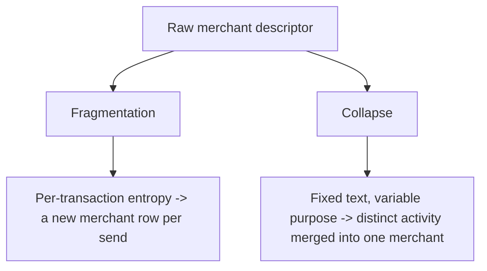

# The problem

The pipeline uses `merchant_id` as both a counterparty's identity and the handle for bulk recategorization. Wrapper descriptors — Zelle, Venmo, ATM withdrawals, processors like Bambora/Square/Stripe — break that overload in two opposite directions.

## two-failure-modes — Two failure modes

**Fragmentation:** descriptors carry per-transaction entropy (e.g. Zelle confirmation hashes), so two payments to the same person get different `merchant_id`s. The naive normalizer only lowercases and strips digits — it does not strip the alphabetic part of a hash.

**Collapse:** descriptors have fixed identifying text but variable purpose (e.g. `ATM Withdrawal 896 MANHATTAN AV`), so semantically distinct spend collapses into one `merchant_id`.

## concrete-examples — Concrete examples

| Symptom | Example from the live database |
| --- | --- |
| Fragmentation | Two $666 Zelles to Tania (XXX-4352) land on `merchant_id` 2382 and 2393 because the confirmation hashes differ |
| Collapse | 16 ATM withdrawals at `896 MANHATTAN AV` all share `merchant_id=1534`, despite encoding nanny pay ($1,040–$1,075), a gift withdrawal ($253.50), and partial-pay variants ($573.50) |

## tooling-gap — The tooling gap

`recategorize_merchant` is a bulk operation, and the MCP surface exposes no per-transaction recategorize tool. The only workaround today is a raw `UPDATE` via `run_sql`, which violates the project's "no raw write SQL" guardrail. [Tier 1](../tier-1/index.html) closes that gap; [Tier 2](../tier-2/index.html) fixes the identity model so the bulk tool becomes useful again.
