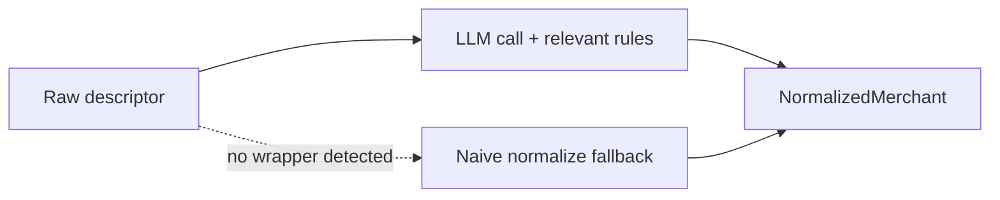

# The LLM normalizer

The normalizer learns about wrapper descriptors with an LLM call, not deterministic per-vendor matchers. Hand-written `is_zelle` / `extract_zelle_party` functions are brittle and one-per-vendor does not scale to the long tail.

## rules-repository — The extraction-rule repository

Maintain one entry per known channel/vendor (Zelle, Venmo, ATM, PayPal, Stripe, Bambora, …), each a plain-English description of *what to extract* (counterparty, phone tail, sub-merchant) and *what to discard* (confirmation hashes, note fields, per-transaction entropy). These codify what the deterministic `extract_*` functions would have done, but in natural language the model interprets. Keep them in-repo (a YAML/markdown asset under `backend/`, loaded like the existing prompt/taxonomy files) so they are versioned and reviewable.

## normalized-merchant — Structured output



The call returns a structured record rather than a bare string:

```python
@dataclass
class NormalizedMerchant:
    normalized_name: str     # stable identity key, e.g. "zelle:tania:4352"
    display_name: str        # e.g. "Zelle: Tania (XXX-4352)"
    source_channel: str      # "zelle" | "venmo" | "atm" | "direct" | ...
    counterparty: str | None # "Tania (XXX-4352)" | None for direct merchants
```

For direct merchants (no wrapper detected) the model falls back to the existing naive normalization.

## build-notes — Build notes

- **Cache by raw descriptor.** Descriptors repeat heavily; an LLM call per descriptor on the sync path is a cost/latency change. Memoize on the exact raw descriptor so each distinct one resolves once.
- **Structured output.** If the call uses a JSON schema, mind the Gemini `additionalProperties` gotcha (AGENTS.md) — the harness strips it, but verify the schema round-trips.
- **This is a rewrite touching callers.** `normalize_merchant_name(descriptor) -> str` becomes `normalize_merchant(descriptor) -> NormalizedMerchant`. The get-or-create paths (`facade.bulk_insert_derived_transactions`, `insert_derived_transaction`) must consume the new fields and populate `source_channel` / `counterparty` on merchant creation. In scope and expected.

## ambiguous-channels — Purpose-ambiguous channels

ATM withdrawals — and any channel where a transaction's *purpose* is not knowable from the descriptor — normalize to a **single identity per counterparty/location** (one merchant for `896 MANHATTAN AV`). We deliberately do not split by amount band or guess purpose; there is no reliable signal. A user who wants "$1,040 ATM withdrawals = nanny pay" expresses that as a user-defined merchant rule. Per-row fixes are [Tier 1](../tier-1/index.html)'s job.
